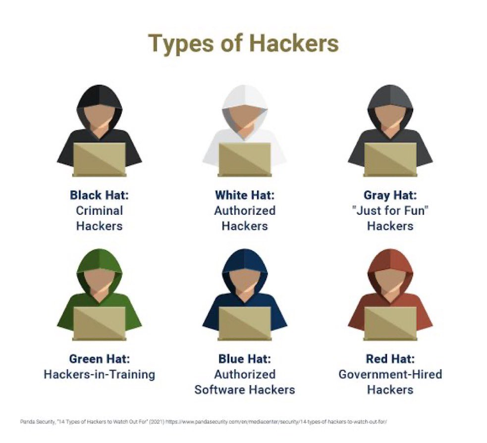

# Red Teamer: Duties, Responsibilities, Career Progression and Resources

This document outlines the core duties and responsibilities of a Red Teamer, followed by a typical career progression path.

---

## Duties and Responsibilities

- Conduct reconnaissance and threat modeling to gather intelligence on targets and define objectives.

- Plan and execute covert simulated attacks across networks, applications, endpoints and physical environments.

- Develop, customize and deploy offensive tools and exploits (e.g., Metasploit, Cobalt Strike, custom scripts).

- Perform social engineering assessments (phishing, pretexting, baiting) to gauge human security resilience.

- Test physical security controls by attempting authorized facility breaches and badge cloning.

- Execute post-exploitation activities: privilege escalation, lateral movement, persistence and data exfiltration.

- Analyze detection gaps in SIEM, IDS/IPS and EDR systems; collaborate with Blue Team to improve monitoring logic.

- Document detailed attack narratives, findings, impact assessments and remediation recommendations.

- Stay current on emerging TTPs (tactics, techniques, procedures), zero-days and threat actor frameworks.

---

## Career Progression

| Tier | Role                          | Key Focus                                      |
|------|-------------------------------|------------------------------------------------|
| 1    | Junior Red Teamer / Pentester | Assist on engagements, basic exploit validation |
| 2    | Red Team Operator             | Lead attack phases, tool development, reporting |
| 3    | Senior Red Teamer             | Design complex scenarios, mentor juniors       |
| 4    | Red Team Lead / Manager       | Oversee operations, client engagement, strategy |
| 5    | Director of Offensive Security / CISO | Define organizational offensive strategy, budget and policy |

---

## Next Steps and Growth

- Pursue advanced certifications (OSCP, OSEP, CRTO, OSCE) to validate hands-on skills.

- Contribute to open-source tools or publish research to build reputation.

- Present at security conferences (DEF CON, Black Hat, BSides) and join red-team communities.

- Cross-train in blue-team and purple-team disciplines to enhance holistic security understanding.


## Resources 
- [kali linux](https://github.com/djmahe4/Ethical_Hacking_Cyber_Forensics_FTTP-IIITK/blob/main/Penetration%20Testing%20with%20Kali%20Linux.pdf)
- [free certs](https://github.com/cloudcommunity/Free-Certifications?tab=readme-ov-file#security)
- [SQLi notes](https://www.linkedin.com/posts/deepmarketer_sqli-notes-activity-7350016569676099584-l55y)
- [free certs](https://www.linkedin.com/feed/update/urn:li:activity:7371164566770081792)
## Recommended learning platforms 

**[thexssrat](labs.thexssrat.com)<br>
[PentesterLab](https://pentesterlab.com/)<br>
[hackthebox_eu](https://www.hackthebox.com/)<br>
[RealTryHackMe](https://tryhackme.com/)<br>
[Hackutendotcom](https://hackuten.com/)<br>
[PortSwigger](https://portswigger.net/)<br>
[247CTF](https://247ctf.com/)**
## Types of hackers -> [link](https://x.com/cyber_razz/status/1952278585173045370)

## Roadmap by [SecurityTrybe](https://x.com/SecurityTrybe/status/1949827839731150914)

```
Red Team Roadmap 🔴🎯

├── Foundations  
│   ├── Networking Basics  
│   │   ├── TCP/IP & Protocol Exploitation  
│   │   ├── DNS & DHCP Attacks  
│   │   ├── Subnetting & Network Mapping  
│   │   └── Topology Enumeration  
│   ├── Operating Systems  
│   │   ├── Windows  
│   │   │   ├── Active Directory Enumeration & Attacks  
│   │   │   ├── Group Policy Exploitation  
│   │   │   └── Event Log Evasion  
│   │   └── Linux  
│   │       ├── File Permission Exploits  
│   │       ├── Syslog Manipulation  
│   │       └── Scripting (Bash, Python, PowerShell)  
│   └── Cybersecurity Core  
│       ├── Attack Surface Analysis  
│       ├── Threat Modeling (MITRE ATT&CK)  
│       ├── Exploit Development Basics  
│       └── Common Attack Vectors  

├── Threat Intelligence  
│   ├── OSINT  
│   │   ├── Tools (Maltego, Recon-ng, SpiderFoot)  
│   │   └── Data Sources (Shodan, Censys, WHOIS)  
│   ├── Reconnaissance  
│   │   ├── Passive & Active Recon  
│   │   ├── Social Engineering Techniques  
│   │   └── Target Profiling  
│   └── IOCs Evasion  
│       ├── Obfuscating IPs, Domains, Hashes  
│       └── File Signature Manipulation  

├── Offensive Operations  
│   ├── Exploitation  
│   │   ├── Tools (Metasploit, Cobalt Strike)  
│   │   ├── Vulnerability Exploitation (Exploit-DB, Custom Exploits)  
│   │   └── Payload Development  
│   ├── Post-Exploitation  
│   │   ├── Privilege Escalation  
│   │   ├── Lateral Movement  
│   │   └── Persistence Techniques  
│   ├── Evasion  
│   │   ├── AV/EDR Bypass  
│   │   └── Log Evasion & Obfuscation  
│   └── Network Attacks  
│       ├── MITM (ARP Spoofing, SSL Stripping)  
│       └── Protocol Exploitation  

├── Vulnerability Exploitation  
│   ├── Vulnerability Discovery  
│   │   ├── Tools (Burp Suite, Nmap)  
│   │   └── Manual Testing Techniques  
│   ├── Exploit Development  
│   │   ├── Writing Custom Exploits  
│   │   └── Shellcode Basics  
│   └── Configuration Exploits  
│       ├── Misconfiguration Identification  
│       └── Exploiting Weak Configurations  

├── Identity & Access Attacks  
│   ├── Credential Harvesting  
│   │   ├── Phishing & Keylogging  
│   │   └── Password Cracking (Hashcat, John the Ripper)  
│   ├── Privilege Escalation  
│   │   ├── Exploiting Misconfigured RBAC/ABAC  
│   │   └── Bypassing MFA/SSO  
│   └── Identity Spoofing  
│       ├── Token Impersonation  
│       └── Account Takeover  

├── Network & Architecture Attacks  
│   ├── Network Exploitation  
│   │   ├── Bypassing VLANs & Firewalls  
│   │   └── Attacking Microsegmentation  
│   ├── Zero Trust Evasion  
│   │   ├── Bypassing Identity Checks  
│   │   └── Exploiting Trust Misconfigurations  
│   └── Encryption Attacks  
│       ├── Weak TLS/SSL Exploitation  
│       └── VPN Vulnerabilities  

├── Social Engineering  
│   ├── Phishing Campaigns  
│   │   ├── Email & Vishing Attacks  
│   │   └── Payload Delivery  
│   └── Pretexting  
│       ├── Impersonation Techniques  
│       └── Social Engineering Frameworks  

├── Compliance & Governance Evasion  
│   ├── Audit Evasion  
│   │   ├── Bypassing Audit Trails  
│   │   └── Log Tampering  
│   └── Policy Exploitation  
│       ├── Exploiting Weak Policies  
│       └── Circumventing Compliance Controls  

├── Advanced Offensive Techniques  
│   ├── Advanced Persistence  
│   │   ├── Rootkits & Backdoors  
│   │   └── Living Off the Land (LotL)  
│   ├── Adversary Simulation  
│   │   ├── Purple Teaming  
│   │   └── ATT&CK Framework Emulation  
│   └── Custom Tooling
```
