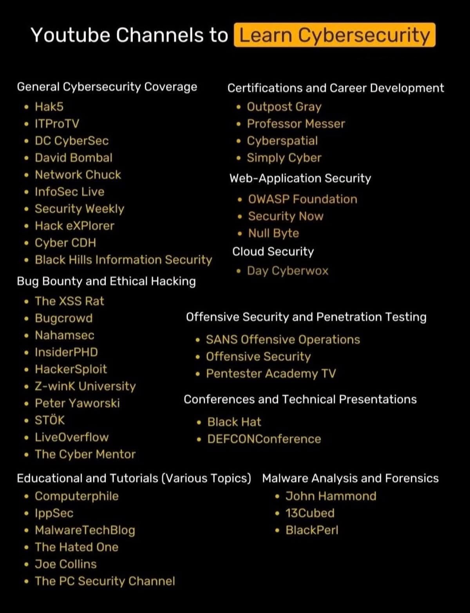

# Cybersecurity General Roadmap

[ref1](https://www.youtube.com/watch?v=ovj9RUobN-Q) 
[ref2](https://x.com/omoalhajaabiola/status/1986113145249706425)

## Networking

- **[Jeremy IT CCNA](https://www.youtube.com/watch?v=H8W9oMNSuwo&list=PLxbwE86jKRgMpuZuLBivzlM8s2Dk5lXBQ&index=1)**
- **[ComPTIA Network+](https://www.youtube.com/watch?v=k7IOn3TiUc8&list=PLG49S3nxzAnl_tQe3kvnmeMid0mjF8Le8&index=1)**

## Linux
- **[FreeCodeCamp](https://www.youtube.com/watch?v=sWbUDq4S6Y8)**
- **[Network Chuck](https://www.youtube.com/watch?v=ugt3PBeqHIo&list=PLIhvC56v63IJIujb5cyE13oLuyORZpdkL&index=10)**
- **[cybersecplayground (telegram)](https://t.me/s/cybersecplayground?q=Linux+for+Hackers)**

## Databases
- **[Programming with Mosh](https://www.youtube.com/watch?v=7S_tz1z_5bA)**
- **[FreeCodeCamp](https://www.youtube.com/watch?v=HXV3zeQKqGY)**
## Cybersecurity Fundamentals
- **[Comptia security+](https://www.youtube.com/watch?v=KiEptGbnEBc&list=PLG49S3nxzAnl4QDVqK-hOnoqcSKEIDDuv&index=1)**
- **[TheSocialDork (hands on labs)](https://www.youtube.com/watch?v=N0dEC1nuWCQ)**

### Youtube channels

## Video Tutorials 

**[CisCo CCNA cloud computing training videos](https://drive.google.com/drive/mobile/folders/1nfMk2J6zd5Sjmj9vKS-Pw9DX4HBeNLJ_)**

**[CompTIA cloud essentials training video  ](https://drive.google.com/drive/mobile/folders/1Cb2IRbxoIHyc0BM8e0-6FRHRczBum6r9?usp=drive_open)**

  

**[CompTIA network security training video](https://drive.google.com/drive/mobile/folders/1X_9B33qINeXXS92WrSPCjybIYgwcPFof)**
